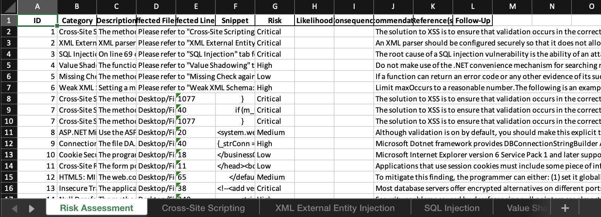
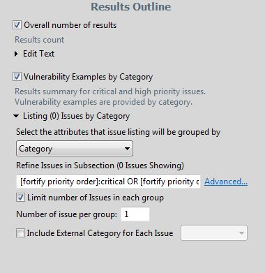

# Fortify Parser XML to Excel
A Parser to convert Fortify .XML report to Excel format with multi-tab option for extensive records.

The output will be in `.xlsx` file format.

# Pre-requisite
- Python 3 and libraries
- File (.xml) that is generated from Fortify

## Generate .XML from Fortify
1. Go to Audit Workbench to gnerate your report
2. Under "Results Outline" panel, open up the listings sections
3. Uncheck the limit number of issues in each group setting if checked

To simply workflow, you can first check issues and analysis before generating .xml report.

## Usage
Run `python3 main.py -f <input filie in .xlsx> -t <tab name of first excel sheet> -m <max record to display before creating new sheets for the category> -o <output filename>`

